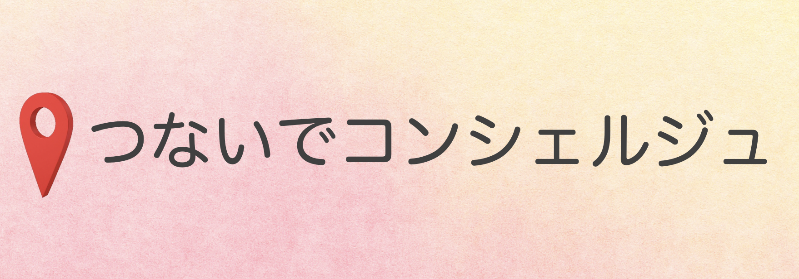

# つなげてコンシェルジュ（執筆中）

<!---->

## 製品概要
### プランニング × Tech

### 背景（製品開発のきっかけ、課題等）
「せっかく休日に友達と遊びに行くことになったけど，特に行きたいところもないし…」
「行きたいところはあるけど，晩御飯の時間までちょっと時間空くなぁ…」
「デートプランを考えるのめんどくさいなぁ…」

みなさんもこのようなこと，ありますよね．

### 製品説明（具体的な製品の説明）

### 特長

#### 1. 特長1
時間・予算などの条件を指定できる

#### 2. 特長2
手軽に使用できる

#### 3. 特長3

### 解決出来ること
お出かけプランの計画からの解放．もし面白くなくても責任逃れできる．

### 今後の展望
今回は実現できなかったが、今後改善すること、どのように展開していくことが可能かについて記載をしてください。

* 巡回順序

## 開発内容・開発技術
### 活用した技術
#### API・データ
* AWS EC2
* Google Cloud API
* もっとくわしく

#### フレームワーク・ライブラリ・モジュール
* Vue.js
* Flask

#### デバイス
* スマートフォン

### 研究内容・事前開発プロダクト（任意）
ご自身やチームの研究内容や、事前に持ち込みをしたプロダクトがある場合は、こちらに実績なども含め記載をして下さい。

* なし？
* 

### 独自開発技術（Hack Dayで開発したもの）
#### 2日間に開発した独自の機能・技術
* 独自で開発したものの内容をこちらに記載してください
* 特に力を入れた部分をファイルリンク、またはcommit_idを記載してください（任意）

* ルート検索のアルゴリズム
